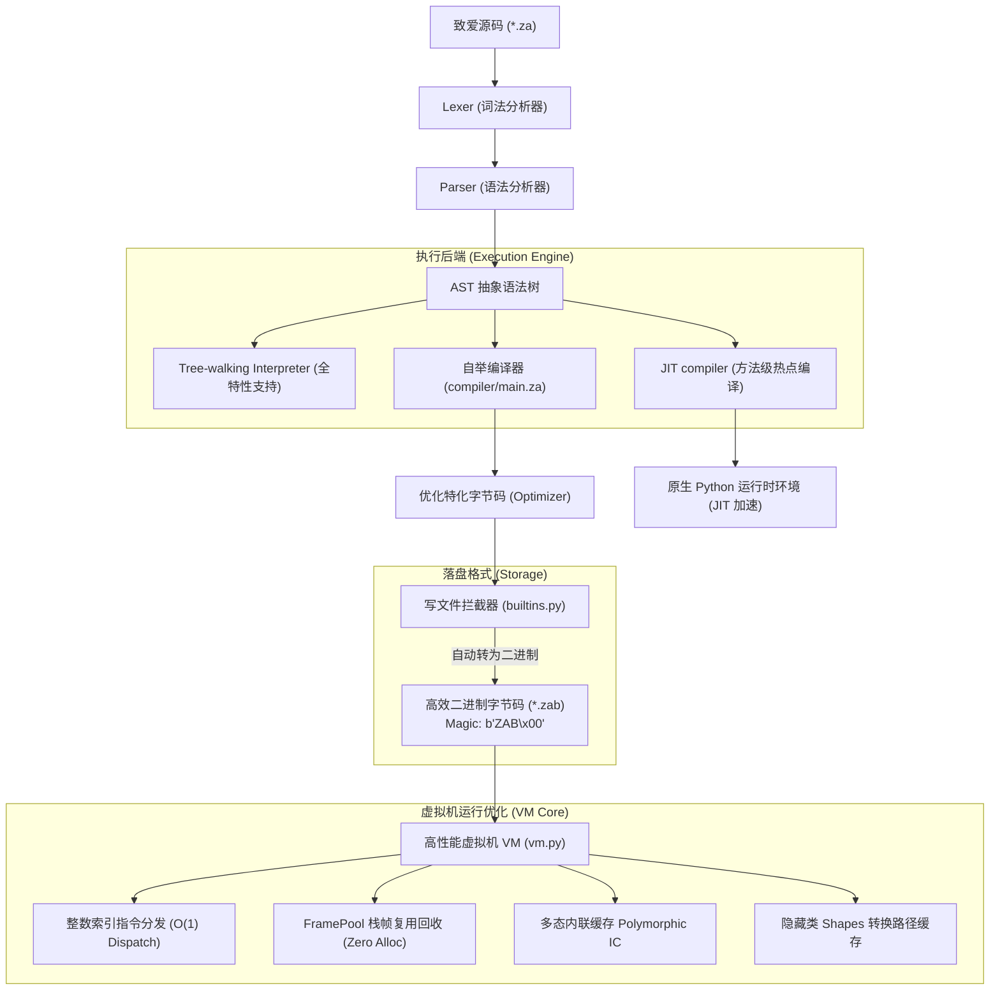

<div align="center">
  
  <h1>🌸 致爱 (ZhiAi) 编程语言 🌸</h1>
  <p><em>“因为一份纯粹的心意，所以有了这门语言。For Elysia 🌸”</em></p>
  
  <p>
    <a href="#-核心特性"><b>核心特性</b></a> •
    <a href="#-系统技术架构"><b>系统技术架构</b></a> •
    <a href="#-v106-终极高性能版-jit-pic-gc--simd"><b>v1.0.10 终极高性能版</b></a> •
    <a href="#-核心语法速览"><b>核心语法速览</b></a> •
    <a href="#-内置标准库大全"><b>内置标准库大全</b></a> •
    <a href="#-vs-code-超级插件生态"><b>IDE生态支持</b></a>
  </p>
</div>

---

致爱（ZhiAi）是一门完全以 **中文** 为核心语法的通用自举编程语言。从底层分词、语法解析、自举编译器、虚拟机制冷缓存到高阶面向对象特性，全部采用贴近自然中文习惯的表达方式。

我们致力于为中文母语者提供直观、零阻碍且极具现代化语言质感的编码体验。

---

## ✨ 核心特性

- 🌸 **完全中文化**：摆脱晦涩的英文关键字，用 `让`、`常量`、`如果`、`函数`、`尝试...捕获` 等直观语义描述逻辑。
- ⚡ **混合执行架构 (全特性对齐)**：
  - **解释器模式**：递归下降 Tree-walking 解释器，现已完整支持 `类`、`实例`、`延迟` 等所有高级语法。
  - **字节码 VM 模式**：基于高集成度指令集与 Frame 缓存池的虚拟机，稳定高效。
  - **极速 JIT 模式**：方法级实时编译，支持复杂指令（异常处理、对象创建）的原生加速。
  - **AOT 编译模式**：依托底层转译机制，直接将代码编译为**无需依赖的原生二进制 EXE 程序**。
- ⚙️ **完整面向对象与闭包**：支持基于原型 Shape 的类体系、继承、构造函数、方法分派，以及支持静态词法作用域分析的闭包函数。
- 📦 **高性能二进制序列化**：专有的 `.zab` 二进制字节码封装，搭载 `b"ZAB\x00"` 专属魔数头部，微秒级瞬时载入。
- 🎨 **完美 IDE 生态**：配套官方 VS Code 扩展，支持**可视化调试 (DAP)**、跳转定义、实时诊断与自动修复。

---

## 🚀 系统技术架构

致爱编程语言拥有完整且闭环的生命周期编译与运行链条。以下是其底层的混合架构执行机制：



---

## 🚀 v1.0.10 终极高性能版 (JIT, PIC, GC & SIMD) 🌸

在全新的 `v1.0.10 - Elysia Edition` 中，致爱语言的底层虚拟机制冷缓存与执行引擎迎来了终极升华，打通了从面向对象多态极速分发、方法级实时编译到物理硬件指令并行的完整技术闭环：

### 1. 🧬 静态单赋值 (SSA) 与 Phi 函数架构
* **支配树分析**：致爱 JIT 现在在编译期会构建完整的控制流图 (CFG)，并计算支配边界 (Dominance Frontier)。
* **Phi 节点动态分配**：在循环和条件分支汇合点自动插入 Phi (Φ) 节点。这使得 JIT 生成的代码具备了工业级的死代码消除与常量传播优化潜力。

### 2. ⚡ 多态内联缓存 (Polymorphic Inline Caching, PIC)
* **超越单态限制**：从原有的单态缓存升级为**全功能多态内联缓存 (PIC)**。当在同一处属性访问遇到不同的 `Shape` 时，缓存结构会平滑扩展（MONO -> POLY -> MEGA），为多个不同的类实例缓存物理偏移量。
* **终极加速**：完全消除了在复杂多态调用场景下重新遍历类方法字典或进行链式隐藏类查找的性能瓶颈。

### 2. ⚡ 方法级实时编译器 (Method JIT Compiler)
* **精准热点编译**：引入了极具扩展性的 JIT 引擎。当函数执行次数达到阈值时，自动将其编译为原生 Python 代码执行。
* **高指令覆盖**：支持 `BINOP` 算术、`TRY/CATCH` 异常回退、`MAKE_ARRAY/OBJECT` 以及 `CALL_METHOD` 的原生加速。

### 3. ♻️ 三色标记精确式垃圾回收器 (Exact Mark-Sweep GC)
* **无死角精确扫描**：升级为真正的**三色标记-清扫（Mark-and-Sweep）精确式垃圾回收器**。
* **深度可达性追溯**：GC 能够高精度地扫描求值栈、全局变量、活跃栈帧 `locals` 以及链式闭包环境。精确解耦循环引用，保证海量数据流下的内存稳定性。

### 4. 🧮 向量化 SIMD 与并发原语
* **SIMD 硬件加速**：原生提供 `向量 (Vector)` 对象，在有 NumPy 支撑的环境下自动开启硬件级向量化指令加速。
* **现代并行原语**：通过 `异步(任务)` 开启后台线程，利用 `并行映射(函数, 数组)` 自动分发多核 CPU 计算任务。

### 🛡️ 5. 解释器特性全对齐 (Feature Parity)
* **不再有“功能断层”**：Tree-walking 解释器（`zhiai run`）现已完美支持 `类`、`实例`、`延迟 (Defer)` 等所有高级语法。源码即运行，无需强制编译，开发调试体验达到统一。

---

## 📖 核心语法速览

### 变量、常量与延迟执行
```zhiai
让 名字 = "小明"
延迟 函数() 输出("清理任务已执行") 结束 // 函数结束前必执行

如果 名字 == "小明" 则
    输出("欢迎你，小明！")
结束
```

### 面向对象编程 (OOP)
```zhiai
类 宠物猫
    函数 构造(名字) 这.名 = 名字 结束
    函数 介绍() 输出("我是 " + 这.名) 结束
结束

让 我的猫 = 新 宠物猫("花花")
我的猫.介绍()
```

### 安全处理模式 (Option / Result)
```zhiai
让 结果 = 成功(100)
如果 结果.是否成功() 则
    输出("数值: " + 转换文字(结果.获取()))
结束
```

---

## 📚 内置标准库大全 (部分展示)

| 类别 | 常用函数 | 功能说明 |
| :--- | :--- | :--- |
| **文件** | `读文件`, `写文件`, `文件存在` | 完整 UTF-8 支持，.zab 自动二进制化 |
| **JSON** | `解析JSON`, `生成JSON` | 深度集成致爱对象与数组 |
| **图形** | `对话框`, `创建窗口`, `创建按钮` | 基于 Tkinter 的可视化交互 |
| **计算** | `矩阵相乘`, `向量`, `正则匹配` | BATCH_OP 原生指令加速 |
| **系统** | `时间`, `格式化`, `命令行参数` | 高精度时间戳与灵活排版 |

---

## 💻 VS Code 超级插件生态 (v1.0.10)

1. 🎛️ **可视化调试 (DAP)**：支持断点、单步（F10/F11）、实时变量观察与 VM 栈监控。
2. 🚨 **实时诊断**：500ms 输入防抖诊断，支持 `如果说` -> `如果` 等语病的**一键 Quick Fix**。
3. 🧠 **深度补全**：作用域感知补全，支持 `对象.` 操作符后的 Shape 成员智能提示。
4. 📦 **ZAP 管理器 GUI**：侧边栏玻璃态卡片中心，一键搜索、下载并集成第三方中文模块。
5. 🧼 **自动格式化**：Token 驱动的保存自动排版，完美对齐中文代码块。

---

## 💝 寄语

致爱（ZhiAi）不仅仅是一个虚拟机或者一门自举编译器，它因为一份真诚而温暖的心意诞生。

> “愿每一行中文代码，都能如这门语言的名字一般，传递出纯粹、简单而美好的心意。For Elysia 🌸”
