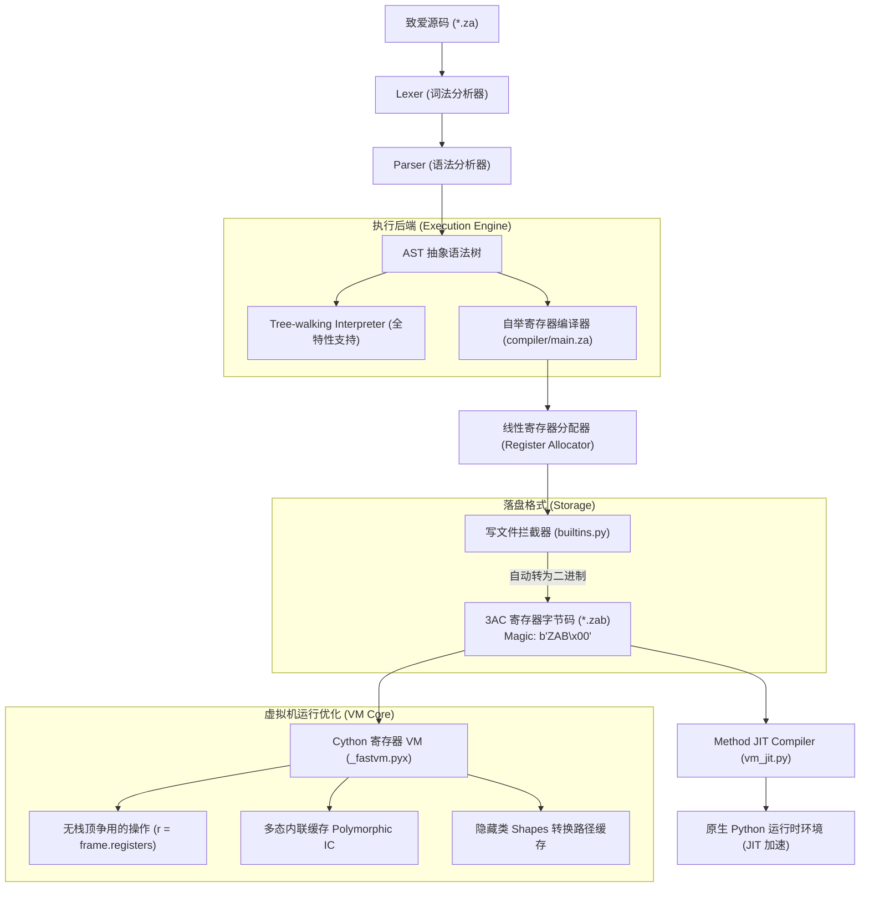

<div align="center">
  
  <h1>🌸 致爱 (ZhiAi) 编程语言 🌸</h1>
  <p><em>“因为一份纯粹的心意，所以有了这门语言。For Elysia 🌸”</em></p>
  
  <p>
    <a href="#-核心特性"><b>核心特性</b></a> •
    <a href="#-系统技术架构"><b>系统技术架构</b></a> •
    <a href="#-v110-史诗级重构-高阶寄存器架构-与-现代语法糖"><b>v1.1.0 史诗级重构</b></a> •
    <a href="#-核心语法速览"><b>核心语法速览</b></a> •
    <a href="#-内置标准库大全"><b>内置标准库大全</b></a> •
    <a href="#-vs-code-超级插件生态"><b>IDE生态支持</b></a>
  </p>
</div>

---

致爱（ZhiAi）是一门完全以 **中文** 为核心语法的通用自举编程语言。从底层分词、语法解析、自举编译器、虚拟机制冷缓存到高阶面向对象特性，全部采用贴近自然中文习惯的表达方式。

我们致力于为中文母语者提供直观、零阻碍且极具现代化语言质感的编码体验。

---

## ✨ 核心特性

- 🌸 **完全中文化**：摆脱晦涩的英文关键字，用 `让`、`常量`、`如果`、`函数`、`尝试...捕获` 等直观语义描述逻辑。
- ⚡ **混合执行架构 (全特性对齐)**：
  - **解释器模式**：递归下降 Tree-walking 解释器，现已完整支持 `类`、`实例`、`延迟` 等所有高级语法。
  - **寄存器字节码 VM 模式**：基于全新 3AC (三地址码) 寄存器指令集的虚拟机，消除栈顶操作瓶颈，极速运行。
  - **极速 JIT 模式**：原生 Python 闭环编译引擎，将 3AC 字节码零成本映射为 Python 原生运算，并辅以 CFG 与 SSA 深度分析。
  - **AOT 编译模式**：依托底层转译机制，直接将代码编译为**无需依赖的原生二进制 EXE 程序**。
- ⚙️ **完整面向对象与闭包**：支持基于原型 Shape 的类体系、继承、构造函数、方法分派，以及支持静态词法作用域分析的闭包函数。
- 📦 **高性能二进制序列化**：专有的 `.zab` 二进制字节码封装，搭载 `b"ZAB\x00"` 专属魔数头部，微秒级瞬时载入。
- 🎨 **完美 IDE 生态**：配套官方 VS Code 扩展，支持**可视化调试 (DAP)**、跳转定义、实时诊断与自动修复。

---

## 🚀 系统技术架构

致爱编程语言拥有完整且闭环的生命周期编译与运行链条。以下是其底层的混合架构执行机制：



---

## 🚀 v1.1.0 史诗级重构: 高阶寄存器架构 与 现代语法糖 🌸

在全新的 `v1.1.0 - Elysia Edition` 中，致爱语言完成了史诗级的“心脏移植”手术。我们彻底抛弃了传统的栈式虚拟机（Stack-based VM），全面拥抱**基于寄存器的虚拟机（Register-based VM）**架构，并引入了大量现代语法糖。

### 1. ⚙️ 全新基于寄存器的虚拟机 (Register-based Architecture)
* **3AC 指令集设计**：重构了底层的 ISA（指令集架构），采用了 `ADD dest, src1, src2` 形式的三地址码（3AC）指令。这使得单一指令就能完成原本需要 4 条 PUSH/POP 指令才能完成的工作，**大幅减少了指令分发（Dispatch）的开销**。
* **无限寄存器分配**：自举编译器 (`compiler/main.za`) 现在内置了一个**线性寄存器分配器**。所有的 AST 节点、局部变量和临时计算结果都会在编译期被精确地映射到虚拟机的调用帧（Frame）数组中，完全消除了运行时的栈操作。
* **JIT 与 Cython 极速升华**：由于新的字节码天然就是三地址码，JIT 编译器 (`vm_jit.py`) 的开发难度骤降。它现在可以直接将寄存器字节码 1:1 翻译成极为纯粹的原生 Python 局部变量操作，使得 JIT 性能上限再次被推高。同时，Cython 高速引擎 (`_fastvm.pyx`) 也全面切轨寄存器数组操作。

### 2. 🍭 现代语法糖：极致优雅的编码体验
* **模式匹配 (`匹配...于`)**：提供了一个强大且优雅的 `switch/case` 替代方案。在自举编译器中，它会被智能地展开为底层的寄存器级别的条件判断，无需额外的运行时开销。
* **安全处理传播 (`?` 操作符)**：配合标准的 `Result / Option` 类型，现在只需在表达式后加上一个 `?`，虚拟机（`TRY_PROPAGATE` 寄存器指令）就能在底层自动拦截并向上传播失败状态，消除了漫长且繁琐的 `如果...则` 错误检查。
* **原生字符串插值 (`{变量}`)**：在双引号字符串中，您可以直接使用 `{}` 注入变量。自举编译器会使用极其巧妙的方法将插值转化为底层的参数翻转、函数调用和寄存器累加，保持极小开销。

### 3. 🧬 静态单赋值 (SSA) 与 三色标记精确式 GC
* **支配树与 Phi 节点**：JIT 引擎通过构建 CFG 和计算支配边界，进行着工业级的全局值编号 (GVN) 与死分支消除优化。
* **精确式 GC**：真正的**三色标记-清扫（Mark-and-Sweep）精确式垃圾回收器**，能够高精度地扫描寄存器数组、全局环境及活跃栈帧。

### 4. 🧮 向量化 SIMD 与并发原语
* **协程通道与 Actor 模型**：引入了 `异步` / `等待` 协程原语，以及 Go-style 的 `通道 (Channel)`。
* **SIMD 硬件加速**：提供原生 `向量 (Vector)` 对象，自动开启硬件级向量化指令加速。

---

## 📖 核心语法速览

### 变量、字符串插值与安全传播
```zhiai
让 名字 = "致爱"
让 版本 = "v1.1.0"
// 1. 字符串插值
输出("你好，我是{名字}，当前版本：{版本}")

函数 危险操作(值)
    如果 值 < 0 则 返回 失败("不能为负数") 结束
    返回 成功(值 * 10)
结束

函数 测试(值)
    // 2. 问号语法糖自动解包或提前返回失败
    让 结果 = 危险操作(值)? 
    输出("计算成功：" + 转换文字(结果))
    返回 成功(结果)
结束
```

### 模式匹配 (Pattern Matching)
```zhiai
函数 评价分数(分)
    匹配 分 于
        100: 输出("满分！")
        90:  输出("优秀")
        60:  输出("及格")
        否则: 输出("继续努力")
    结束
结束
```

---

## 📚 内置标准库大全 (部分展示)

| 类别 | 常用函数 | 功能说明 |
| :--- | :--- | :--- |
| **文件** | `读文件`, `写文件`, `文件存在` | 完整 UTF-8 支持，.zab 自动二进制化 |
| **JSON** | `解析JSON`, `生成JSON` | 深度集成致爱对象与数组 |
| **图形** | `对话框`, `创建窗口`, `创建按钮` | 基于 Tkinter 的可视化交互 |
| **计算** | `矩阵相乘`, `向量`, `正则匹配` | BATCH_OP 原生指令加速 |
| **系统** | `时间`, `格式化`, `命令行参数` | 高精度时间戳与灵活排版 |

---

## 💻 VS Code 超级插件生态 (v1.0.11)

1. 🎛️ **可视化调试 (DAP)**：支持断点、单步（F10/F11）、实时变量观察与 VM 栈监控。
2. 🚨 **实时诊断**：500ms 输入防抖诊断，支持 `如果说` -> `如果` 等语病的**一键 Quick Fix**。
3. 🧠 **深度补全**：作用域感知补全，支持 `对象.` 操作符后的 Shape 成员智能提示。
4. 📦 **ZAP 管理器 GUI**：侧边栏玻璃态卡片中心，一键搜索、下载并集成第三方中文模块。
5. 🧼 **自动格式化**：Token 驱动的保存自动排版，完美对齐中文代码块。

---

## 💝 寄语

致爱（ZhiAi）不仅仅是一个虚拟机或者一门自举编译器，它因为一份真诚而温暖的心意诞生。

> “愿每一行中文代码，都能如这门语言的名字一般，传递出纯粹、简单而美好的心意。For Elysia 🌸”
