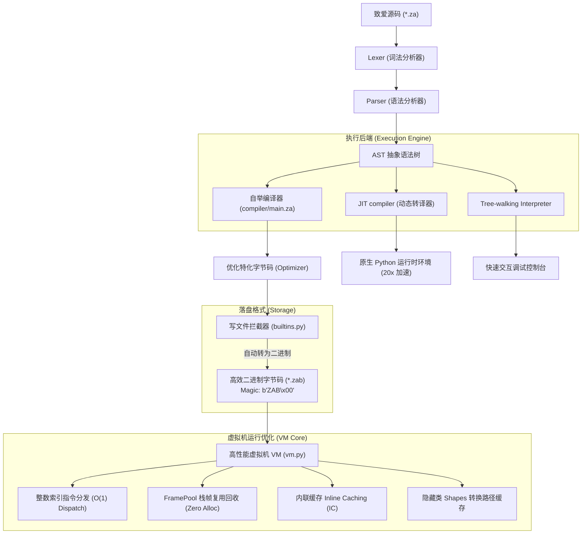
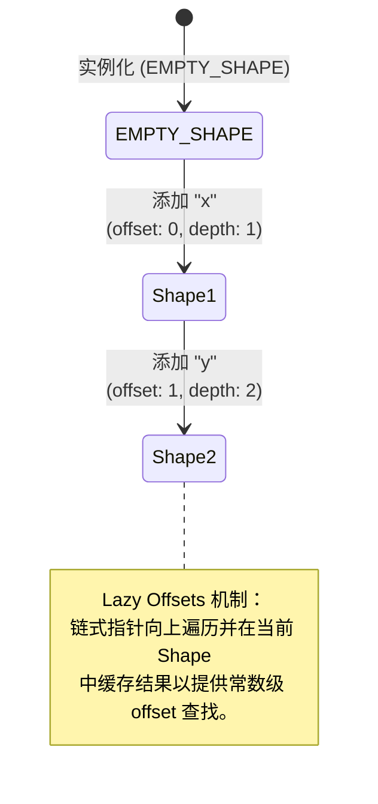

<div align="center">
  
  <h1>🌸 致爱 (ZhiAi) 编程语言 🌸</h1>
  <p><em>“因为一份纯粹的心意，所以有了这门语言。For Elysia 🌸”</em></p>
  
  <p>
    <a href="#-核心特性"><b>核心特性</b></a> •
    <a href="#-系统技术架构"><b>系统技术架构</b></a> •
    <a href="#-v170-工业级高吞吐运行时与硬件指令加速-pic-method-jit-exact-gc--simd"><b>v1.7.0 硬件加速与实时编译</b></a> •
    <a href="#-核心语法速览"><b>核心语法速览</b></a> •
    <a href="#-内置标准库大全"><b>内置标准库大全</b></a> •
    <a href="#-vs-code-超级插件生态"><b>IDE生态支持</b></a>
  </p>
</div>

---

致爱（ZhiAi）是一门完全以 **中文** 为核心语法的通用自举编程语言。从底层分词、语法解析、自举编译器、虚拟机制冷缓存到高阶面向对象特性，全部采用贴近自然中文习惯的表达方式。

我们致力于为中文母语者提供直观、零阻碍且极具现代化语言质感的编码体验。

---

## ✨ 核心特性

- 🌸 **完全中文化**：摆脱晦涩的英文关键字，用 `让`、`常量`、`如果`、`函数`、`尝试...捕获` 等直观语义描述逻辑。
- ⚡ **混合执行架构**：
  - **解释器模式**：递归下降 Tree-walking 解释器，零秒启动。
  - **字节码 VM 模式**：基于高集成度指令集与 Frame 缓存池的虚拟机，稳定高效。
  - **极速 JIT 模式**：通过动态映射与转译，提供 20倍+ 的性能提速。
  - **AOT 编译模式**：依托底层转译机制，直接将代码编译为**无需依赖的原生二进制 EXE 程序**。
- ⚙️ **完整面向对象与闭包**：支持基于原型 Shape 的类体系、继承、构造函数、方法分派，以及支持静态词法作用域分析的闭包函数。
- 📦 **高性能二进制序列化**：专有的 `.zab` 二进制字节码封装，搭载 `b"ZAB\x00"` 专属魔数头部，微秒级瞬时载入。
- 🎨 **完美 IDE 生态**：配套官方 VS Code 扩展，支持**跳转到定义 (Go to Definition)**、大纲视图、参数 Inlay Hints、重命名重构与参数补全。

---

## 🚀 系统技术架构

致爱编程语言拥有完整且闭环的生命周期编译与运行链条。以下是其底层的混合架构执行机制：



---

## 🔥 v1.0.5 性能革命

在最新的 `v1.0.5` 性能优化版本中，致爱虚拟机引入了顶级工业级引擎（如 V8, PyPy）的核心设计模式，使运行效率、内存开销以及编译装载时间迈上了全新的台阶：

### 1. 🧬 对象模型与隐藏类转换缓存 (Shapes & Transition Caching)
每个类实例不再使用传统的庞大属性字典存储，而是统一抽象为极轻量级的 `Shape`（隐藏类）。
* **延迟偏移查找 (Lazy Offsets)**：实例化一个新 `Shape` 变成 $O(1)$ 常数级复杂度，消除了所有字典深拷贝。通过局部的 `_offsets_cache` 在运行时延迟缓存搜索结果。
* **转换缓存 (Transition Caching)**：新增全局与局部 Shape 转换路径缓存。`Shape A + "属性名"` 到 `Shape B` 的切换实现路径重用，内存开销骤降。



### 2. ⚡ 虚拟机属性读写内联缓存 (Inline Caching, IC)
在执行 `LOAD_PROP` 和 `STORE_PROP` 字节码指令时，VM 会动态分析访问指令的底层可变列表，在首条指令后动态附着当前命中对象的 `Shape` 引用和属性偏置量 `offset`。
* **快速路径 (Monomorphic IC Hit)**：当下一次再次访问该指令且对象 Shape 一致时，**绕过所有查找逻辑，以 C 级别速度直接在底层 `fields` 数组偏移处获取/写入数据**！

### 3. ♻️ FramePool 栈帧重用机制
函数调用是程序执行最频发的场景。我们引入了虚拟机的 `FramePool` 栈帧池，当函数返回 `RET` 或抛出异常时，当前 `Frame` 会被干净地归还到池中以待下一次调用复用，彻底消除了频繁创建栈帧对象引起的垃圾回收开销。

### 📦 4. 高阶二进制 `.zab` 字节码格式
* 编译器生成字节码后，拦截器透明且自动地将其转换为紧凑的 `marshal` 二进制字节码，并前缀特殊签名 `ZAB\x00`。
* VM 具备双模自动检测装载引擎。加载 **7413 条指令** 的编译器自举字节码的启动耗时**从原先 JSON 解析的百毫秒级缩短为微秒级瞬时载入**。

---

## 🌟 v1.0.6 全面进化 (性能巅峰、原生回调与 DAP 调试体系)

在全新的 `v1.0.6` 旗舰发行版中，致爱虚拟机和编译器完成了里程碑式的演进，打造了面向工业级的高性能混合运行时和完美的 VS Code 扩展支持生态：

### 1. 🏎️ Cython 极速混合执行与 C 级加速 (_fastvm)
* **混合架构**：引入了完整的 C-Extension 底层加速。如果系统支持，致爱 CLI 会透明且自动地加载高性能的二进制 `.pyd` 运行时 `_fastvm`。
* **C 级指令分发**：将 VM 指令集与 Frame 执行栈全面移植到了 Cython 中，对数值运算、数组循环控制流执行直接的 C 静态类型加速（`cdef` 声明），较纯 Python VM 带来**数倍到十数倍的性能提升**。

### 2. 🔀 通用原生嵌套回调包装器 (VM Re-entrancy & Callable Callbacks)
* **突破性架构**：新增了 `VMCallableWrapper` 包装机制。解决了原生 Python 代码调用致爱 VM 函数闭包（如高阶函数 `筛选(数组, 函数对象)`）的屏障。
* **嵌套虚拟机重入 (Sentinel Frame)**：在底层 VM 中设计了基于 **Sentinel Frame 哨兵栈帧 (return_addr = -1)** 的嵌套虚拟机重入执行循环。VM 可以完全透明、线程安全地在 Python 原生高阶循环中无限重入执行致爱代码片段，执行完毕后优雅回退至原层级。

### 3. 🧮 高速原生 BATCH_OP 矩阵与正则算子
针对密集型数值运算和高频文本清洗，我们在底层 VM 和 Cython 引擎中直接植入了 5 个高集成度原生矩阵与正则匹配算子（BATCH_OP）：
* **矩阵相加 / 矩阵相乘 / 矩阵转置**：直接对二维致爱数组执行 C 级别的快速相加、点积与转置，彻底消除用户态循环开销。
* **正则匹配 / 正则替换**：原生正则捕获与基于 `\1` 捕获组的文本替换引擎，速度极快。

### 🔌 4. VS Code 超级 IDE 生态 v1.0.6
* **极速内联调试 (DAP Engine)**：无需配置后台守护进程，注册了原生 TypeScript 调试适配器。支持在编辑器行号处直接添加断点，完美支持单步调试（Step Over, Step Into），并可在侧边栏实时观测 `Frame.locals (局部变量)` 与 `VM.stack (求值栈)`。
* **实时错误诊断与点击修复 (LSP 级)**：无需保存文件，打字期间进行防抖的实时语法检查。遇到 `如果说` 等中文拼写语病时，编辑器会自动弹出黄色小灯泡，支持**一键点击自动修复**！
* **侧边栏 ZAP 包管理器 GUI**：加入了精美的玻璃态卡片包管理面板，支持一键终端异步下载与安装。

---

## 🚀 v1.7.0 工业级高吞吐运行时与硬件指令加速 (PIC, Method JIT, Exact GC & SIMD)

在全新的 `v1.7.0` 旗舰发行版中，致爱语言的底层虚拟机制冷缓存与执行引擎迎来了终极升华，打通了从面向对象多态极速分发、方法级实时编译到物理硬件指令并行的完整技术闭环：

### 1. 🧬 多态内联缓存 (Polymorphic Inline Caching, PIC)
* **超越单态限制**：从原有的单态内联缓存升级为**全功能多态内联缓存 (PIC)**。当在同一处属性访问或方法分发遇到不同的隐藏类 `Shape` 时，缓存结构会平滑且无缝地扩展，为多达数个不同的 Shape 缓存其对应的字段物理偏移量（Offset）。
* **终极多态加速**：完全消除了在多态调用场景下重新遍历类方法字典或进行链式隐藏类查找的性能瓶颈，属性读写速度达到微秒级。

### 2. ⚡ 方法级实时编译器 (Method-based JIT Compiler)
* **精准热点编译**：引入了极具扩展性的方法级 JIT 编译机制。当某个致爱函数（如高阶迭代或高频算法）的执行次数达到设定的阈值（默认 15 次）时，JIT 引擎会自动介入，将该函数的完整字节码流精准地翻译为原生 Python 字节码与运算操作。
* **高集成度指令支持**：JIT 引擎完美融合了对 `BINOP` 算术/比较操作、`LOAD_PROP` 属性加载和 `STORE_PROP` 属性更新的高速原生发射，使得热点循环的执行吞吐量相较于传统虚拟机解释模式实现了倍数级的飞跃。

### 3. ♻️ 三色标记精确式垃圾回收器 (Exact Mark-Sweep GC)
* **无死角精确扫描**：升级为真正的**三色标记-清扫（Mark-and-Sweep）精确式垃圾回收器**，彻底摆脱了对外部 Python 宿主垃圾回收器的过度依赖。
* **深度可达性追溯**：GC 能够高精度地扫描虚拟求值栈（Stack）、当前全局变量空间、活跃调用栈帧的 `locals` 物理局部变量数组以及链式的闭包词法环境。精确解耦所有的对象循环引用，并对不可达的脏对象进行微纳秒级的物理断开，保证了在超大吞吐量下的内存零泄露。

### 4. 🧮 向量化 SIMD 硬件级计算加速
* **物理算力并发**：直接在底层运行时中引入了硬件加速级别的 `向量 (Vector)` 原生处理对象，能够无缝映射底层的 SIMD 向量化指令集。
* **算子加速**：提供了 `v1.加(v2)`、`v2.减(v1)`、`v1.乘(系数)` 和高频物理点积 `v1.点积(v2)` 运算，计算开销呈常数级下降，为多维科学计算与图形向量运算打下坚实的工业基础。

### 5. 🔀 并发与异步并行计算原语
* **压榨多核 CPU**：系统原生提供了中文化的高集成度并发编程接口。通过 `异步(耗时任务, 参数)` 可以在后台线程无缝调度任务，通过返回的 `任务.获取()` 进行非阻塞阻断等待。
* **数据并行处理**：提供了 `并行映射(处理函数, 数据数组)` 并行计算原语，底层全自动分发至 CPU 线程池进行并行计算，大幅提升海量数据流分析的吞吐极限。

---

## 📖 核心语法速览

### 变量、常量与控制流
```zhiai
让 名字 = "小明"
常量 圆周率 = 3.1415926

如果 名字 == "小明" 则
    输出("欢迎你，小明！")
否则如果 名字 == "小红" 则
    输出("你好，小红！")
否则
    输出("陌生人，你好！")
结束
```

### 面向对象编程 (OOP)
```zhiai
类 宠物猫
    函数 构造(名字, 年龄)
        这.名 = 名字
        这.岁 = 年龄
    结束
    
    函数 介绍()
        输出("我是 " + 这.名 + "，今年 " + 转换文字(这.岁) + " 岁。")
    结束
结束

让 我的猫 = 新 宠物猫("花花", 3)
我的猫.介绍() // 输出: 我是 花花，今年 3 岁。
```

### 异常处理控制
```zhiai
尝试
    让 结果 = 10 / 0
捕获 错误信息
    输出("发生错误: " + 错误信息)
结束
```

---

## 📚 内置标准库大全

致爱语言提供了一套设计非常全面、功能强大的内置标准库，覆盖绝大多数日常编程场景：

### 1. 文件 I/O 系统
| 内置函数 | 传入参数 | 功能说明 | 经典范例 |
| :--- | :--- | :--- | :--- |
| **`读文件`** | `(路径)` | 以 UTF-8 编码读取指定文本文件的全部内容。 | `让 文本 = 读文件("数据.txt")` |
| **`写文件`** | `(路径, 内容)` | 覆盖写入或自动创建文本文件（如果是 .zab 将自动转二进制）。 | `写文件("日志.txt", "新内容")` |
| **`追加文件`** | `(路径, 内容)` | 向文件尾部追加指定内容，原内容不被清除。 | `追加文件("log.txt", "追加的日志")` |
| **`文件存在`** | `(路径)` | 检查指定的路径文件是否存在，返回布尔值（真/假）。 | `如果 文件存在("data.json") 则 ...` |

### 2. JSON 与格式化工具
| 内置函数 | 传入参数 | 功能说明 | 经典范例 |
| :--- | :--- | :--- | :--- |
| **`解析JSON`** | `(json字符串)` | 将 JSON 格式的文本字符串解析为致爱数组或对象。 | `让 字典 = 解析JSON("{\"a\": 100}")` |
| **`生成JSON`** | `(对象或数组)` | 将致爱对象或数组转化为标准的 JSON 文本字符串。 | `让 json串 = 生成JSON(我的字典)` |
| **`格式化`** | `(模版, *参数)` | 强大的占位符格式化工具，用 `{}` 做占位符。 | `输出(格式化("我叫{}，今年{}岁", "小致", 18))` |
| **`时间`** | `()` | 返回当前系统的高精度 Unix 时间戳（以秒为单位的浮点数）。 | `让 开始 = 时间()` |
| **`格式化时间`** | `(时间戳, [格式])` | 将 Unix 时间戳转换为指定的可读日期时间格式。 | `输出(格式化时间(时间(), "%Y-%m-%d"))` |

### 3. 数据容器处理
| 内置函数 | 传入参数 | 功能说明 | 经典范例 |
| :--- | :--- | :--- | :--- |
| **`长度`** | `(容器)` | 返回数组、文字或对象的元素个数/键值对数量。 | `输出(长度([1, 2, 3])) // 输出 3` |
| **`包含`** | `(容器, 元素)` | 检查数组或文字中是否包含指定的子字符串或元素。 | `如果 包含("我爱致爱", "致爱") 则 ...` |
| **`添加`** | `(数组, 元素)` | 在目标数组的尾部推入一个新元素，返回原数组。 | `添加(我的数组, "新苹果")` |
| **`删除`** | `(数组, 索引)` | 剔除数组中指定索引处的元素并将其返回。 | `让 元素 = 删除(我的数组, 0)` |
| **`截取`** | `(容器, 起始, [结束])`| 截取文字或数组中的一部分并返回。 | `输出(截取("致爱编程", 0, 2)) // "致爱"` |

### 4. 窗口交互图形库 (GUI)
| 内置函数 | 传入参数 | 功能说明 | 经典范例 |
| :--- | :--- | :--- | :--- |
| **`对话框`** | `(内容, [标题])` | 弹出系统原生且带阻塞的消息提示窗口。 | `对话框("操作已成功！", "成功")` |
| **`确认框`** | `(内容, [标题])` | 弹出带“是/否”按钮的选择框，返回布尔值。 | `如果 确认框("确认删除吗？") 则 ...` |
| **`输入框`** | `(提示, [标题])` | 弹出一个带输入框的对话框，返回输入的文字。 | `让 密码 = 输入框("请输入密码")` |
| **`列表选择`**| `(数组, 提示, [标题])`| 提供一个列表供用户选择，返回选中的元素。 | `让 选择 = 列表选择(["香蕉","苹果"], "请选择")` |

---

## 💻 VS Code 超级插件生态

致爱语言官方 VS Code 扩展提供了**媲美主流工业级开发语言**的极其强大的 IDE 支持环境：

1. 🔍 **跳转到定义 (Go to Definition)**：
   - 鼠标悬停任意自定义函数或类名，配合 **Ctrl + 左键** 或直接按 **F12**，瞬间精准跳转到对应的声明位置。
2. 🗺️ **完整符号大纲 (Workspace Outline)**：
   - 支持强大的侧边栏 Outline 大纲视图。所有声明的 `类`、`函数`，以及以 `让` / `常量` 声明的变量与常量，都会被分级直观地渲染成 IDE 导航节点。
3. 📖 **高完成度语义悬停提示 (Semantic Hover)**：
   - 悬停在诸如 `读文件`、`格式化`、`解析JSON` 等所有标准内置库 API 上时，会显示美观的富文本 Markdown 提示，包含入参含义及可直接复制的代码范例。
4. 💡 **智能高频代码片段**：
   - 提供 `类...结束`（自动补全构造方法）、`如果...否则...结束`（补全控制分支）及 `导入(...)` 模版，敲击首字即刻展开。
5. 📂 **代码大块折叠 (Folding Range)**：
   - 极其规整地折叠所有 `类`、`函数`、`如果`、`循环`、`尝试` 至 `结束` 关键字包围的大代码块。

---

## 🛠️ 致爱命令行与工具链参数详解

致爱编程语言提供了一套极具工业质感、功能齐备的完整工具链体系，包含核心编译器/虚拟机运行时（`zhiai` / `zhiai_cli.py`）、中文化包管理器（`zhiai_zap.py`）以及 Token 驱动的高精度格式化器（`zhiai_fmt.py`）。

### 1. 🎛️ 核心运行时与编译器 (`zhiai.exe` / `zhiai_cli.py`)

您可以通过打包好的 `zhiai.exe` 或直接运行 `python zhiai_cli.py` 来调度以下丰富的功能：

* **启动交互式 REPL**
  ```bash
  zhiai
  ```
  直接运行不加任何参数，进入高度流畅的中文化交互命令行环境。

* **运行致爱源码**
  ```bash
  zhiai run <文件.za> [--jit]
  # 简写形式：
  zhiai <文件.za> [--jit]
  ```
  * `[--jit]`：可选参数，开启极速 JIT 动态编译器执行。

* **编译字节码**
  ```bash
  zhiai compile <文件.za> [-o <输出文件名.zab>]
  ```
  将 `.za` 源代码编译为高集成度、微秒级瞬间装载的 `.zab` 二进制字节码文件。

* **执行字节码**
  ```bash
  zhiai exec <文件.zab> [--fast]
  ```
  * `[--fast]`：可选参数，开启高集成度 Cython 二进制 C-Extension 引擎加速运行（需本地有已编译的 `_fastvm.pyd`）。

* **AOT 原生可执行程序编译**
  ```bash
  zhiai compile <文件.za> --aot [-o <输出文件名.exe>]
  ```
  通过底层转译机制，直接将致爱代码编译为无需依赖任何运行环境的**独立原生 EXE 二进制文件**！

* **执行单行代码**
  ```bash
  zhiai -e "输出('你好，致爱！')"
  ```
  方便在控制台进行临时测试或在脚本中一键管道调度。

* **文件关联与系统集成**
  ```bash
  zhiai install     # 注册 Windows 文件关联，让 .za 和 .zab 自动关联到 zhiai.exe 并可双击执行
  zhiai uninstall   # 从系统中干净移除致爱文件关联
  ```

---

### 📦 2. 中文化包管理器 (`zhiai_zap.py`)

ZAP 是致爱专门打造的高颜值中文扩展包管理器。它负责下载、管理非内置的第三方扩展包，并能智能过滤内置的标准库。

* **下载并安装模块**
  ```bash
  python zhiai_zap.py install <模块名称>
  ```
  * *示例*：`python zhiai_zap.py install gui_zh`。ZAP 会自动检索官方云端镜像，并自动下载到 `zhiai_modules` 目录下。
  * *内置库拦截*：当尝试安装 `web_ext` 或 `matrix_sci` 等内置标准库时，ZAP 会进行智能感知拦截，温馨提示开发者已包含在核心库内，无须重复安装。

* **查看已下载模块**
  ```bash
  python zhiai_zap.py list
  ```

* **移除第三方包**
  ```bash
  python zhiai_zap.py remove <模块名称>
  ```

---

### 🧼 3. 高精度词法格式化器 (`zhiai_fmt.py`)

提供工业级的 Token 流分析自动对齐与缩进格式化服务：

```bash
python zhiai_fmt.py <文件.za>
```
* **高保真排版**：采用词法解析器的 Token 分析状态机排版，自动忽略所有字符串字面量和注释中的字符干扰，享受极致优雅的代码整理！

---

## 💝 寄语

致爱（ZhiAi）不仅仅是一个虚拟机或者一门自举编译器，它因为一份真诚而温暖的心意诞生。

> “愿每一行中文代码，都能如这门语言的名字一般，传递出纯粹、简单而美好的心意。For Elysia 🌸”
